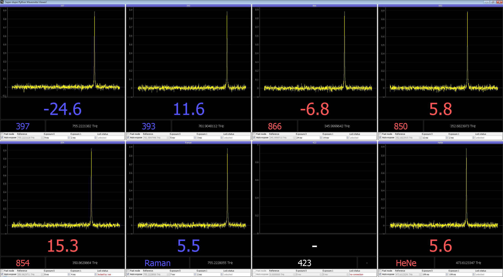

# WAnD Super-Duper Laser Diagnostics

Wavelength Analysis and Display laser diagnostics suite.

A WAnD server (an instance of `wand_server`) controls a single wavelength meter, fibre switcher and set of optical spectrum analysers (OSAs). It provides network interfaces that clients can connect to in order to control the server (e.g. schedule wavelength readings, change exposure times, etc) and to receive updates (parameter changes, new frequency data).

WAnD clients, such as the GUI or laser locker, can connect to multiple servers (and, each server can support connections from multiple clients).

To allow multiple clients to simultaneously request frequency data, potentially from different lasers (using a fibre switch) the server works on a priority queue basis. Frequency requests are queued and dealt with in order of the requested priority and the request time.

Since many applications can tolerate data that is slightly old, the server stores the most recent measurement for each laser. Each frequency request specifies a maximum data age (how long ago the data was taken). The server completes a measurement request from a client as soon as it has data that is younger than the requested age. This also means, for example, that a low-priority measurement can be completed early if a high-priority measurement request for the same laser comes along first.

## Installation

From inside Oxford, this is installed as part of the `artiq_env` Conda package.

From outside Oxford, use Pip to install into an [ARTIQ](https://github.com/m-labs/artiq) Conda environment. You may also need to Pip install a couple of extra packages like `pydaqmx`.

## Starting a server

To start a server run `wand_server -n <name>` where `<name>` is the name of the server.

The name parameter is used to locate the configuration file for the server (named `<name>_server_config.pyon`), which should reside in the root WaND directory. If the configuration file isn't found there, `wand_server` will attempt to copy it from the Oxford shared area (to do: make this less Oxford-specific!). If you're running WaND outside Oxford, you need to manually copy the config file to the root wand directory. NB `wand_server` will periodically attempt to back the configuration file up to the Oxford shared area (again, this should be made less Oxford-specific at some point). You can find an example configuration file in the [examples](wand/examples).

The server can be run in "simulation" mode without hardware access by using the `--simulation` command line argument (use `--help` for a complete list of arguments).

If you get `connection refused` errors when a client tries to connect to the server remember to make sure to add a suitable bind argument (e.g. `--bind=*`).

## Starting a GUI client

To start a GUI client, run `wand_gui -n <name>` where `<name>` is the name of the client. The client configuration file specifies the layout of the GUI and which servers to connect to.
